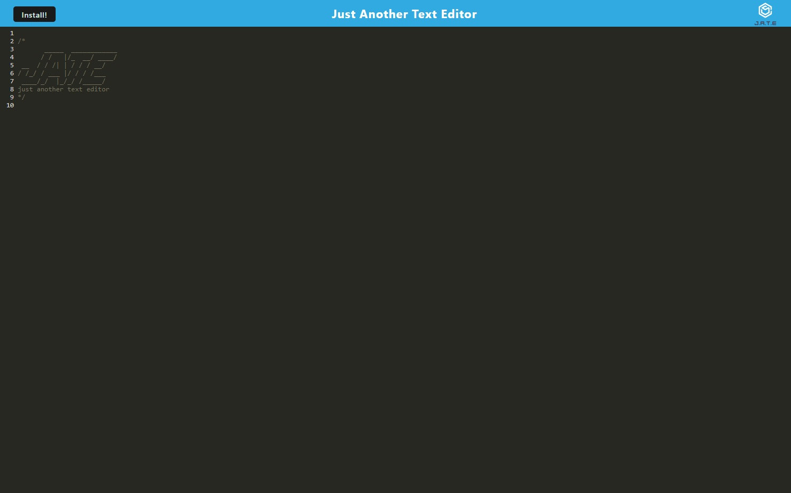

# Just Another Text Editor

## Description

I was tasked with building an in browser text editor that still works when you have low or no internet connection. I used Node.js, Express.js, Nodemon, Concurrently, Babel, Webpack, and IDB.

## Installation

No installation necessary but you can clone the [repository](https://github.com/MrMessyFace/just-another-text-editor) from GitHub to edit it and make your own version. After you have cloned the repository, you would type "npm i" into the terminal to install the NPM packages for the client folder, the server folder, and the overall folder too. After the packages are installed, you would type "npm start" into the terminal to start the server. You would then type "http://localhost:3001/" into your browser to view the app as you edit it. You can also install a desktop version by pressing the Install button in the top left corner.

## Usage

You can edit text in the browser but you can also press the Install button and it will allow you to install it to your desktop.

## Credits

Code was provided by the instructional staff at the Northwestern University Full Stack Coding Bootcamp.

## Helpful Links

- [Repository](https://github.com/MrMessyFace/just-another-text-editor)
- [Live App](https://young-ocean-37817-b9df5f618cd6.herokuapp.com/)

&copy; 2023 Jessie S. Galindo. All Rights Reserved.
